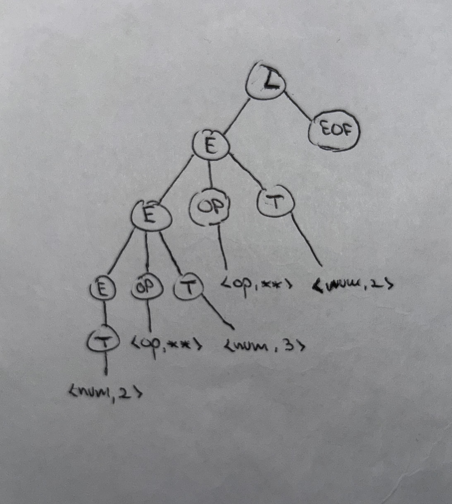

# Syntax Directed Translation with Jison

Jison is a tool that receives as input a Syntax Directed Translation and produces as output a JavaScript parser  that executes
the semantic actions in a bottom up ortraversing of the parse tree.
 

## Compile the grammar to a parser

See file [grammar.jison](./src/grammar.jison) for the grammar specification. To compile it to a parser, run the following command in the terminal:
``` 
➜  jison git:(main) ✗ npx jison grammar.jison -o parser.js
```

## Use the parser

After compiling the grammar to a parser, you can use it in your JavaScript code. For example, you can run the following code in a Node.js environment:

```
➜  jison git:(main) ✗ node                                
Welcome to Node.js v25.6.0.
Type ".help" for more information.
> p = require("./parser.js")
{
  parser: { yy: {} },
  Parser: [Function: Parser],
  parse: [Function (anonymous)],
  main: [Function: commonjsMain]
}
> p.parse("2*3")
6
```
## Development

## Práctica 4

**2.1. Describa la diferencia entre `/* skip whitespace */` y devolver un token.**

/* skip whitespace */ significa que el lexer reconoce el patrón pero no devuelve nada al parser (lo ignora).

Devolver un token significa que el lexer envía una unidad léxica al parser para que la use en el análisis sintáctico.

**2.2. Escriba la secuencia exacta de tokens producidos para la entrada 123\*\*45+@.**

123 → NUMBER \
** → OP \
45 → NUMBER \
\+ → OP \
@ → INVALID

**2.3. Indique por qué ** debe aparecer antes que [-+*/].**

Porque los analizadores léxicos usan la primera regla que coincida, entonces si [-+*/] apareciera antes, la cadena "**" se leería como dos tokens "*" distintos, por lo tanto, es necesario colocar el operador más largo antes.

**2.4. Explique cuándo se devuelve EOF.**

EOF se devuelve cuando el lexer alcanza el final de la entrada, indicándole al parser que no hay más tokens.

**2.5. Explique por qué existe la regla . que devuelve INVALID**

Sirve para capturar carácteres no reconicidos por todas las reglas anteriores, indicando que se ha encontrado un símbolo no válido y por tanto existe un error léxico.

**3. Modifique el analizador léxico de grammar.jison para que se salte los comentarios de una línea que empiezan por //.**

`\/\/.*                { /* ignore comments */; }`

**4. Modifique el analizador léxico de grammar.jison para que reconozca números en punto flotante como 2.35e-3, 2.35e+3, 2.35E-3, 2.35 y 23.**

`[0-9]+(\.[0-9]+)?([eE][-+][0-9]+)?            { return 'NUMBER';       }`

**5.Añada pruebas para las modificaciones del analizador léxico de grammar.jison**
```javascript
  test('Should handle comments', () => {
    expect(parse("// comentario\n2 + 5")).toBe(7);
  })

  test('Should handle floats', () => {
    expect(parse("3.5")).toBe(3.5);
    expect(() => parse("2.35 * 2").toBe(4.7));
    expect(parse("2.35e-3")).toBe(0.00235);
  })
```

## Práctica 5
### **1. Partiendo de la gramática y las siguientes frases 4.0-2.0*3.0, 2\*\*3\*\*2 y 7-4/2:**

**1.1. Escriba la derivación para cada una de las frases**

L => E **eof** => E **op** T eof => E **op** T **op** T eof => T **op** T **op** T eof => 4.0 **op** T **op** T eof => 4.0 - T **op** T eof => 4.0 - 2.0 **op** T eof => 4.0 - 2.0 * T eof => 4.0 - 2.0 * 3.0 eof

L => E **eof** => E **op** T eof => E **op** T **op** T eof => T **op** T **op** T eof => 2 ** 3 ** 2 eof

L => E **eof** => E **op** T eof => E **op** T **op** T eof => T **op** T **op** T eof => 7 - 4 / 2

**1.2. Escriba el árbol de análisis sintáctico (parse tree) para cada una de las frases.**

4.0-2.0*3.0: \


2\*\*3\*\*2: \


7-4/2: \


**1.3. ¿En qué orden se evaluan las acciones semánticas para cada una de las frases? Nótese que la evaluación a la que da lugar la sdd para las frases no se corresponde con los convenios de evaluación establecidos en matemáticas y los lenguajes de programación.**

Todos los operadores (+ - * / **) están en el mismo no terminal OP. Para el parser, todos los operadores son iguales. Entonces la única “regla estructural” que queda es: 
La recursión por la izquierda, lo que fuerza evaluación de izquierda a derecha sin precedencia.